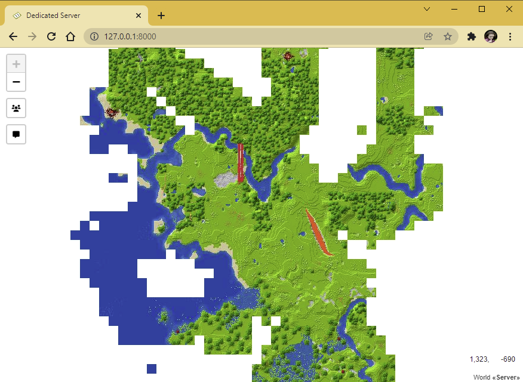

# ⚠ Warning
This project will be rewritten in C# if LiteLoader.NET is actively developed and plugins can be written on it. 
 
**It is not recommended to use the current version of MineNet!**

 
 
 
 
 
 
 
 
 
 
 
 
 
 
 
 
 
 
 
 
 
 
 
 
 
 
 
 

# MineNet
Web map with chat and player list for your Minecraft server
 
 
[Download](https://github.com/aye20054925/MineNet/archive/refs/heads/main.zip)
 

# Install
1. Clone this git
2. Go to Server folder and move **MineNet.js** and **dependencies** folder to **plugins** folder
3. Configure the plugin. To do this, go into MineNet.js and change the line `worldName: 'Server'` to the name of your world (the name can be found by going to **worlds** folder)
4. (Optional) Install Python (3.6.x-3.9.x) and in terminal enter `pip install flask`, so **Flask** is set globally
5. Run server.

## Commands
| Command      | Description | Permission |
| ----------- | ----------- | ----------- |
| /minenet      | Recreate map       | 4 (Only Console)   

# Customization
To customize the map, go to the directory with the plugin, then `dependencies/unmined/Templates/Web`
 
This folder contains **HTML & JS** files that you can edit ,pack in ZIP archive with name 'Web' and move archive to **Templates** folder

# Requirements
- It requires **Windows and Python** on your computer.
- The program require installed **Flask**. To install Flask, type `pip install flask`
- The program uses [**unmined-cli**](https://unmined.net/docs/cli/getting-started/), so it may be unstable.
- The author of the plugin is not responsible for your server and the plugin
- The plugin is experimental, so unstable operation is possible
